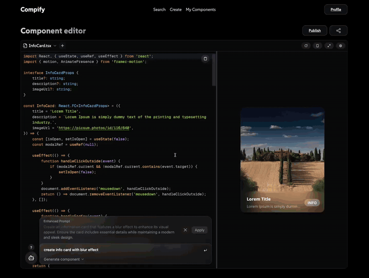

# Compify

[](https://github.com/kubet/compify/actions/workflows/ci.yml)
[](https://github.com/kubet/compify/actions/workflows/codeql.yml)
[](LICENSE)
[](https://bun.sh/)

**Turn a reviewed, supported React CSF source graph into a deterministic shadcn handoff.**

Compify is experimental open-source tooling for statically inspecting selected
React Storybook source, producing a reviewable shadcn registry artifact, and
recording an explicit consumer build. The repository also contains an optional
legacy browser editor and registry/API surfaces; those are not evidence of broad
Storybook compatibility, visual fidelity, adoption, or a generally available
managed platform.

<p align="center">
  <a href="https://compify.app/demo-video.mp4">
    
  </a>
</p>

<p align="center">
  <strong><a href="https://compify.app/demo-video.mp4">Open the full-quality 22-second MP4 with playback controls</a></strong>
</p>

> The recording shows Compify's existing optional browser editor. The release
> candidate's primary workflow is the account-free Storybook-to-shadcn handoff
> below. The recording is not presented as proof of Storybook compatibility or
> destination-build fidelity; those claims are backed by executable checks in
> the [compatibility matrix](docs/compatibility.md).

## Why Compify

Moving a component between applications is rarely just copying one file. The
review boundary can include local imports, aliases, styles, runtime packages,
and consumer-specific installation behavior. Within the statically selected source
graph, Compify makes checked boundaries explicit and rejects detected unsupported
or nonportable inputs instead of silently omitting them:

- **Select deliberately:** a CSF story export is the entry boundary.
- **Inspect statically:** supported source is parsed without importing or
  executing the story.
- **Review exactly:** every selected source file receives a SHA-256 value, and
  the canonical registry artifact receives a stable digest before installation.
- **Install natively:** pinned `shadcn@4.16.2` owns registry validation and file
  installation.
- **Prove the destination:** an explicit consumer build produces a local receipt
  with artifact identity, exact argv, and installed-file hashes.

## Account-free quick start

The Storybook workflow in this repository is an unpublished
`@compify/cli@0.2.0` source candidate. The repository's historical `v0.1.0`
GitHub tag already contains a CLI `0.2.0` manifest; npm independently serves an
older `@compify/cli@0.1.0` artifact from different source history. Do not treat
the tag and package as one release. Build the candidate from source until a
package release is explicitly announced:

```bash
git clone https://github.com/kubet/compify.git
cd compify/packages/cli
bun install --frozen-lockfile
bun run build
bun link
compify --help

# Install the included, already shadcn-initialized consumer.
cd ../../examples/consumer-next-ts
bun install --frozen-lockfile

# Move to the included Storybook fixture.
cd ../storybook-button
```

Inspect its selected story and explain why the component entry is included:

```bash
compify storybook inspect src/Button.stories.tsx \
  --story Primary \
  --explain src/Button.tsx
```

Then hand the reviewed graph to the **different, already shadcn-initialized**
consumer included in the repository:

```bash
compify storybook handoff src/Button.stories.tsx \
  --story Primary \
  --consumer ../consumer-next-ts \
  --build-command bun \
  --build-arg run \
  --build-arg build
```

`handoff` never publishes. It invokes native shadcn without a shell, runs only
the explicit destination build command, and writes a digest-verifiable receipt. A successful receipt is install/build
evidence—not a claim of visual fidelity,
deployment, adoption, or product-market fit.

## Included surfaces

The repository also contains the optional browser editor, public/private
registry API, component client commands, Compify MCP server, Storybook
portability addon,
and a hardened Docker Compose self-hosting baseline. See
[Product direction](PRODUCT.md) for the supported boundary and roadmap.

## Repository layout

| Path | What | Stack |
| --- | --- | --- |
| `apps/web` | Documentation and optional browser editor (preview bundler is operator-supplied) | Next.js 16, React 19, Tailwind |
| `apps/api` | REST API for components and registry artifacts | NestJS 11, TypeORM, PostgreSQL, MinIO |
| `packages/cli` | `compify` CLI, including static Storybook translation | Bun, tsup |
| `packages/storybook` | Manager-only Storybook portability metadata addon | Storybook, React, tsup |
| `packages/compify-pack` | Vendored Sandpack fork used by the editor | React, rollup |
| `packages/templates` | Project templates | — |

## Docs

- [Documentation](docs/index.mdx)
- [Storybook translation](docs/storybook.mdx)
- [Compatibility matrix](docs/compatibility.md)
- [Ecosystem and cloud strategy](docs/ecosystem-strategy.md)
- [Getting started](docs/getting-started.mdx)
- [CLI reference](docs/cli.md)
- [Publishing](docs/publishing.md)
- [shadcn registry interop](docs/registry.md)
- [MCP and the official Storybook MCP](docs/mcp.md)
- [Product-market-fit research](docs/product-market-fit.md)
- [Self-hosting](docs/self-hosting.md)
- [OpenAPI reference](docs/api-reference.mdx)

## Development

Each app is self-contained; there is no workspace hoisting. Bun 1.3.9 is the
only supported package manager, and each package commits its own `bun.lock`.
The production web image uses Next.js's supported runtime while dependencies
and scripts remain Bun-managed.

```bash
# frontend — http://localhost:3000
cd apps/web && bun install && bun run dev

# api — http://localhost:3009 (needs PostgreSQL + MinIO)
cd apps/api && bun install && bun run start:dev

# cli
cd packages/cli && bun install && bun run build
```

## Deployment boundary

Docker Compose provides a reproducible local or single-server self-hosting
baseline. The public repository does not promise a managed hosted deployment or
contain production credentials, topology, or private deployment automation.
Before exposing an installation, follow the security and production checklist
in the [self-hosting guide](docs/self-hosting.md).

## Community and releases

- [Contributing](CONTRIBUTING.md)
- [Support boundaries](SUPPORT.md)
- [Governance](GOVERNANCE.md)
- [Security policy](SECURITY.md)
- [Release process](RELEASING.md)

## License

Original Compify code is MIT-licensed. The vendored `compify-pack` Sandpack
derivative retains its upstream Apache-2.0 license; see
`packages/compify-pack/PROVENANCE.md`.
