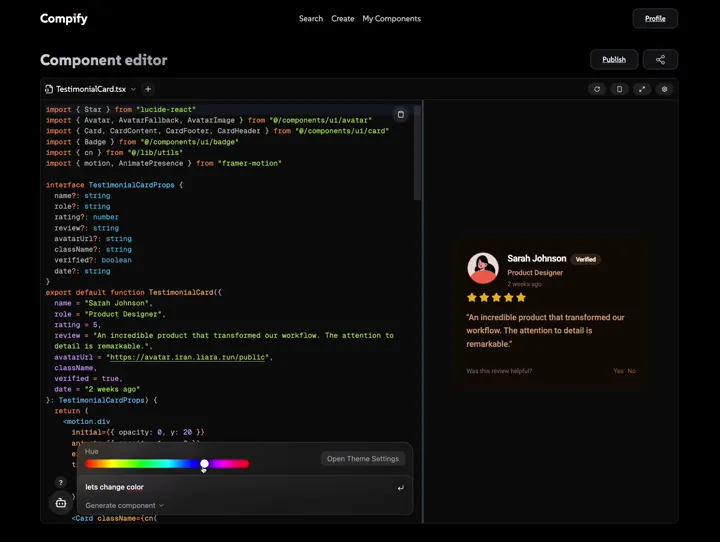

# Compify

Compify statically packages a selected React component graph into reviewable
shadcn registry artifacts, using its Storybook CSF file as the explicit selection
and context boundary. Storybook stays upstream for authoring, tests, and docs;
Compify handles the supported packaging and registry distribution path.

The repository also contains the existing browser editor, registry API,
Bun-powered component CLI, Compify MCP server, and self-hosting baseline. See
[Product direction](PRODUCT.md) for the current/next boundary.

## Prove a cross-app handoff

The release candidate's activation path is local and account-free. After
[building the CLI from source](packages/cli/README.md#build-from-source), point it
at one selected story and a **different**, already shadcn-initialized application:

```bash
compify storybook inspect src/Button.stories.tsx --story Primary --explain src/Button.tsx
compify storybook handoff src/Button.stories.tsx --story Primary \
  --consumer ../consumer-app \
  --build-command bun --build-arg run --build-arg build
```

`handoff` statically selects the source graph, invokes pinned native
`shadcn@4.16.2` without a shell, runs the explicit destination build, and writes
a local digest-signed receipt containing graph/artifact identity, exact argv, and
consumer file hashes. It never publishes implicitly. Review the artifact and
receipt before treating the handoff as approved evidence.

## Existing browser editor demo

<details>
<summary>Watch the 22-second editor demo</summary>

[](docs/assets/demo-video.mp4)

The recording demonstrates the existing optional browser editor: editing React
source and seeing its preview update. It is not evidence for Storybook graph
compatibility, shadcn installation, runtime fidelity, or the newer policy-gated
source-distribution workflow; those claims are backed by the executable evidence
in [the compatibility matrix](docs/compatibility.md).

</details>

## Repository layout

| Path | What | Stack |
| --- | --- | --- |
| `apps/web` | Documentation and optional browser editor (preview bundler is operator-supplied) | Next.js 16, React 19, Tailwind |
| `apps/api` | REST API for components and registry artifacts | NestJS 11, TypeORM, PostgreSQL, MinIO |
| `packages/cli` | `compify` CLI, including static Storybook translation | Bun, tsup |
| `packages/storybook` | Manager-only Storybook portability metadata addon | Storybook, React, tsup |
| `packages/compify-pack` | Vendored Sandpack fork used by the editor | React, rollup |
| `packages/templates` | Project templates | — |

## Docs

- [Documentation](docs/index.mdx)
- [Storybook translation](docs/storybook.mdx)
- [Compatibility matrix](docs/compatibility.md)
- [Ecosystem and cloud strategy](docs/ecosystem-strategy.md)
- [Getting started](docs/getting-started.mdx)
- [CLI reference](docs/cli.md)
- [Publishing](docs/publishing.md)
- [shadcn registry interop](docs/registry.md)
- [MCP and the official Storybook MCP](docs/mcp.md)
- [Product-market-fit research](docs/product-market-fit.md)
- [Self-hosting](docs/self-hosting.md)
- [OpenAPI reference](docs/api-reference.mdx)

## Development

Each app is self-contained; there is no workspace hoisting. Bun 1.3.9 is the
only supported package manager, and each package commits its own `bun.lock`.
The production web image uses Next.js's supported runtime while dependencies
and scripts remain Bun-managed.

```bash
# frontend — http://localhost:3000
cd apps/web && bun install && bun run dev

# api — http://localhost:3009 (needs PostgreSQL + MinIO)
cd apps/api && bun install && bun run start:dev

# cli
cd packages/cli && bun install && bun run build
```

## Deployment boundary

Docker Compose provides a reproducible local or single-server self-hosting
baseline. The public repository does not promise a managed hosted deployment or
contain production credentials, topology, or private deployment automation.
Before exposing an installation, follow the security and production checklist
in the [self-hosting guide](docs/self-hosting.md).

## Community and releases

- [Contributing](CONTRIBUTING.md)
- [Support boundaries](SUPPORT.md)
- [Governance](GOVERNANCE.md)
- [Security policy](SECURITY.md)
- [Release process](RELEASING.md)

## License

Original Compify code is MIT-licensed. The vendored `compify-pack` Sandpack
derivative retains its upstream Apache-2.0 license; see
`packages/compify-pack/PROVENANCE.md`.
